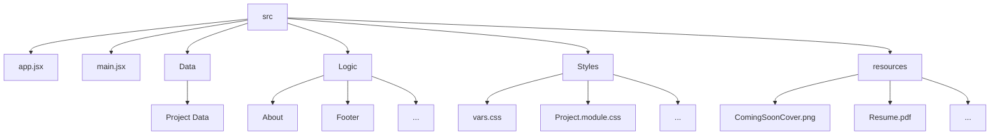

# F.aja - Portfolio

This is a personal portfolio website built with **React.js**.  
It showcases my contact information, resume, and projects I have worked on.

### Architecture Diagram

### Project Status
The project is currently **in development**.  
Planned updates include:
- Adding an About me page
- Expanding the project showcase section
- Improving responsive design
