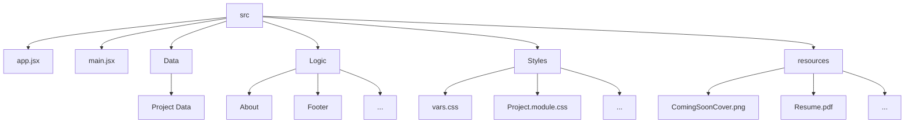

# F.aja - Portfolio

This is a personal portfolio website built with **React.js**.  
It showcases my contact information, resume, and projects I have worked on.

#### UX Design
I designed what i wanted the UX to be like on figma and then made changes to reflect that. The figma link show cases my design process (i'm really proud of my animation frames).
[Portfolio design on Figma](<https://www.figma.com/design/3U9mwoSxpHVC2w35kRYcWv/faja?node-id=0-1&p=f&t=YUDpe7aAPO6kJlCP-0>)

### Architecture Diagram

### Project Status
The project is currently **in development**.  
Planned updates include:
- Adding an About me page
- Expanding the project showcase section
- Improving responsive design
